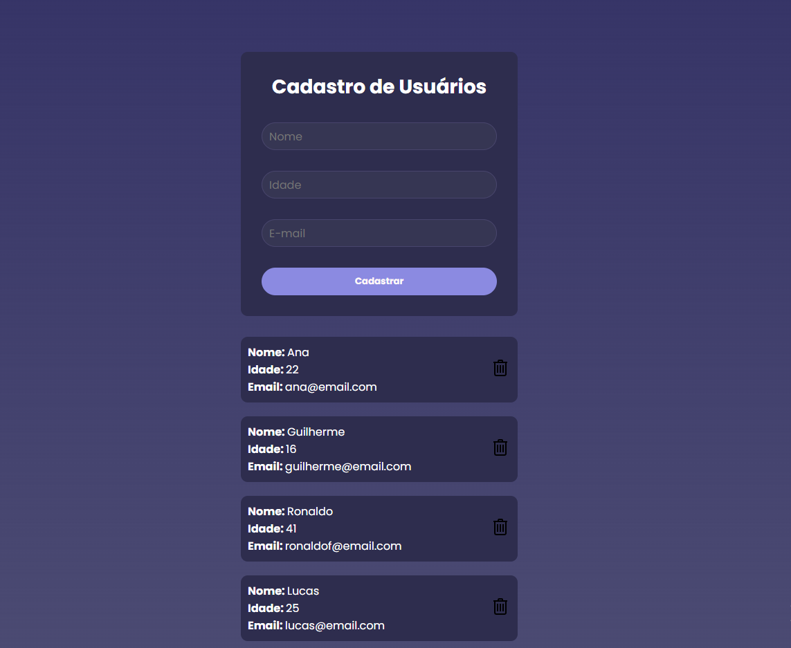
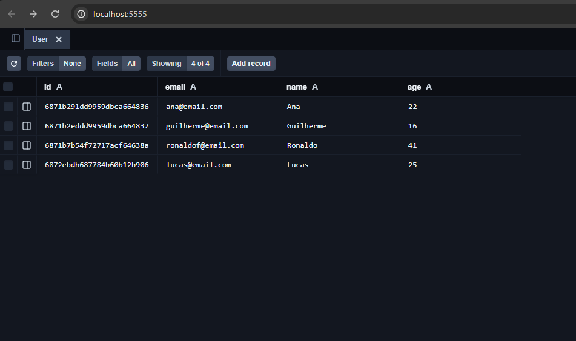

# Cadastro de Usuários

Este é um projeto completo de cadastro de usuários, utilizando:

- **Frontend**: React + Vite
- **Backend**: Node.js, Express
- **Banco de Dados**: MongoDB

---

## 🚀 Como rodar o projeto localmente

### 1. Backend (API)

```bash
cd api
npm install
npx prisma migrate dev --name init
node server.js
```

### 2. Frontend (React)

```bash
cd cadastro
npm install
npm run dev
```

### Estrutura do projeto

cadastro-usuarios/
├── api/            → Backend com Node.js e Prisma
├── cadastro/       → Frontend com React + Vite
├── assets/         → Imagens do projeto
│   ├── interface.png
│   ├── prisma-studio.png
│   └── capa.png
├── README.md       → Documentação do projeto
├── LICENSE
└── .gitignore

## 🖼️ Imagens do Projeto

### Interface (Frontend)


### Banco de Dados (Prisma Studio)


### Capa do Projeto


